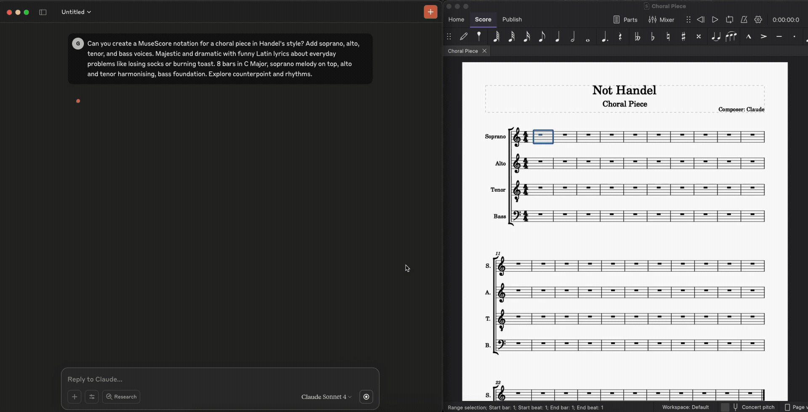

# MuseScore MCP Server

A Model Context Protocol (MCP) server that lets AI assistants like Claude read, analyze, compose, arrange and edit the score open in MuseScore Studio 4, through a WebSocket plugin. Claude reads the score in a compact notation (`C4:q D4 [C4 E4 G4]:h~ ...`) and writes in the same notation, a whole passage or several staves per call, each call one undo step, while you keep working in MuseScore.



## Prerequisites

- MuseScore Studio 4.7 or newer (the plugin uses `removeParts`, which was added to the plugin API in 4.7)
- Python 3.11+
- Claude Desktop or compatible MCP client

## Setup

### 1. Install the MuseScore Plugin

Copy `musescore-mcp-websocket.qml` into your MuseScore plugins folder:

**Windows**: `%USERPROFILE%\Documents\MuseScore4\Plugins\` (if OneDrive syncs your Documents folder: `%USERPROFILE%\OneDrive\Documents\MuseScore4\Plugins\`)
**macOS**: `~/Documents/MuseScore4/Plugins/`
**Linux**: `~/Documents/MuseScore4/Plugins/`

If unsure, MuseScore shows the folder under **Edit → Preferences → Folders → Plugins** (macOS: **MuseScore Studio → Preferences**).

### 2. Enable the Plugin in MuseScore

1. Restart MuseScore (it only scans the plugins folder at startup)
2. Go to **Plugins → Manage plugins…**
3. Find **musescore-mcp-websocket** and enable it

MuseScore 4 lists the plugin under its file name, **musescore-mcp-websocket**, not "MuseScore API Server".

### 3. Setup Python Environment

The folder is `mcp-musescore` when cloned, or `mcp-musescore-main` when downloaded as a ZIP from GitHub.

**Windows (PowerShell):**
```powershell
git clone https://github.com/ghchen99/mcp-musescore.git
cd mcp-musescore
py -3 -m venv .venv
.venv\Scripts\python.exe -m pip install -r requirements.txt
```

**macOS / Linux:**
```bash
git clone https://github.com/ghchen99/mcp-musescore.git
cd mcp-musescore
python3 -m venv .venv
.venv/bin/python -m pip install -r requirements.txt
```

`requirements.txt` pins `mcp[cli]<2`: the server imports `mcp.server.fastmcp`, which was removed in mcp 2.x. The separate `fastmcp` package is not needed.

### 4. Configure Claude Desktop

Add to your Claude Desktop configuration file:

**Windows**: `%APPDATA%\Claude\claude_desktop_config.json`
**macOS**: `~/Library/Application Support/Claude/claude_desktop_config.json`

Windows (note the doubled backslashes in JSON):
```json
{
  "mcpServers": {
    "musescore": {
      "command": "C:\\Users\\YOU\\Downloads\\mcp-musescore-main\\.venv\\Scripts\\python.exe",
      "args": [
        "C:\\Users\\YOU\\Downloads\\mcp-musescore-main\\server.py"
      ]
    }
  }
}
```

macOS / Linux:
```json
{
  "mcpServers": {
    "musescore": {
      "command": "/path/to/mcp-musescore/.venv/bin/python",
      "args": [
        "/path/to/mcp-musescore/server.py"
      ]
    }
  }
}
```

**Note**: Update the paths to match your actual project location.

## Running the System

### Order of Operations

1. **Start MuseScore** and open (or create) a score
2. **Run the plugin**: **Plugins → musescore-mcp-websocket**. Nothing visible happens; it starts listening on port 8765
3. **Start (or restart) Claude Desktop**

### After changing the code

- **Plugin (`.qml`) changes**: copy the file into the plugins folder again, quit and restart MuseScore, then run **Plugins → musescore-mcp-websocket** again.
- **Python changes**: fully quit Claude Desktop (on Windows, also right-click its tray icon → **Quit**; closing the window is not enough) and reopen it.

### Development and Testing

For development, use the MCP development tools:

```bash
# Test your server
mcp dev server.py
```

Offline tests (no MuseScore needed; the plugin tests need [node](https://nodejs.org)):

```bash
pip install -r requirements-dev.txt
python -m pytest            # Python logic, strict validation, notation, the plugin's JavaScript, end to end
node syntax_check.js        # syntax check of the plugin (QML converted to JS, node --check)
node tests/js/test_plugin.js
```

The plugin's JavaScript is run against a mock of MuseScore's plugin API (`tests/js/mock_musescore.js`), and `tests/test_end_to_end.py` runs the real MCP server against the plugin on that mock (`tests/js/mock_server.js`). That tests the plugin's and the server's own logic, not MuseScore: the live tests do that. To run them, open a score saved as `mcp test` (a piano score, so there are two staves), start the plugin, and run:

```bash
python tests/live/test_all.py              # everything; keeps its bars so you can look at them (--cleanup deletes them)
python tests/live/test_step1.py            # the step 1 checks (batches, write_voice, ties)
```

They refuse to run unless every MuseScore window title contains "mcp test", only write into bars they append after the last bar, and check that the original bars are unchanged. See the docstrings for details.

### Viewing Console Output

To see MuseScore plugin console output, run MuseScore from terminal:

**macOS**:
```bash
/Applications/MuseScore\ 4.app/Contents/MacOS/mscore
```

**Windows**:
```powershell
& "C:\Program Files\MuseScore 4\bin\MuseScore4.exe"
```

**Linux**:
```bash
musescore4
```

## Features

71 tools; `skills/mcp-musescore/references/tools.md` is the full reference.

### Reading scores
- `get_score(format, start_measure, end_measure, staves)` - The score in a compact notation, bar by bar and staff by staff, with the instruments (staff numbers, clefs, ranges), key, meter, tempo, markings, the score's version and the cursor. Identical bars and empty bars are collapsed, so long scores stay short. `format="json"` gives the raw data, `"lilypond"` LilyPond.
- `analyze_score()`, `analyze_harmony(...)`, `analyze_phrases(...)`, `analyze_structure()`, `analyze_rhythm(...)`, `get_tempo_map()` - Musical descriptions: key and mode, chords with Roman numerals and loops, phrases, form, rhythm, tempo. Positions as bar.beat.
- `get_selection()` - What you selected in MuseScore ("change these bars"), with its music.
- `open_score(path)` - Open a file (mscz, MusicXML, MIDI, ...) when no score is open.
- `list_instruments(query, group, instrument_id)` - MuseScore's instrument ids with clefs, transpositions, ranges and drum maps.

```
Score "Nocturne" · by Claude · 16 bars · 4/4 · version 1234502
Staves: s0 Flute [flute] treble, range C4-A6 | s1 Piano [piano] treble, range A0-C8 | s2 Piano [piano] bass, range A0-C8
Key: Eb major / C minor (-3)
bar 1 (4/4) tempo q=72 "Lento"
  s0: r:q G4(mf "Hel-") Bb4("lo") Eb5~
  s1: [Eb4 G4 Bb4]:h [Eb4 Ab4 C5](chord=Ab/Eb)
  s2: Eb2:w
bar 2 = bar 1
bars 3-4: rests
```

### Writing music
- `write_voice(notation | events, staff, voice, measure, offset, tick)` - **The main way to write**: a whole passage in one staff and voice, one call, one undo step, checked before anything is written. Notation: `C4:q D4 E4:e F4 | [C4 E4 G4]:h~ [C4 E4 G4]:q r | {3:2 C5:e B4 A4} G4:q.(mf staccato "la")` - note names keep their spelling, durations carry over, `~` ties, `{3:2 ...}` tuplets, markings in parentheses (dynamics, articulations, ornaments, bowings, fermatas, lyrics, text, chord symbols).
- `replace_section(start_measure, end_measure, parts)` - New music for whole bars on several staves/voices at once, one undo step; also appends bars at the end.
- `add_note`, `add_rest`, `add_tuplet`, `add_lyrics` - Single corrections.
- `process_sequence(sequence, atomic)` - Several different actions in one round trip; `atomic=True` makes them one undo step (all or nothing).

Writing can start anywhere (`measure` + `offset` inside the bar, e.g. `"3/8"`): a note held across the start is shortened, never re-struck. Durations that aren't one note value (`"5/8"`) or cross a barline are written as tied notes that add up exactly; nothing is shortened silently.

### Changing what is there
- `transpose(semitones, range, staves, chord_symbols, key_signatures)` - Chromatic transposition with correct spelling; chord symbols move too; `key_signatures=True` changes the key of a piece or section.
- `clear_range(range, staves, voices, markings)` - Empty a range cleanly (whole bars get one bar rest).
- `copy_measures(..., to_staff, transpose)` - Copy bars, also onto other staves and transposed (double a melody an octave higher).
- `delete_measures`, `insert_measure`, `append_measure`, `delete_selection`
- `undo(steps)` / `redo(steps)`

### Markings, text and layout
- `add_dynamic`, `add_fermata`, `add_text` (staff/system/expression), `add_chord_symbol`, `add_pedal_marks` (symbols), `add_clef`
- `set_tempo(bpm, beat_unit, text)`, `add_tempo_change` (rit./accel. with real playback change), `set_time_signature`, `set_key_signature`
- `add_slur`, `add_hairpin`, `add_articulation`, `add_repeat` / `remove_repeat`, `add_marker`, `add_jump`, `add_section_label`, `remove_marking`
- `add_layout_break(line|page|section)`, `set_measures_per_system(count)`

### Score, instruments, files
- `set_score_info(title, subtitle, composer, lyricist)`
- `add_instrument(id, position)`, `set_instrument_name`, `remove_instrument`, `set_instrument_sound`
- `export_score(path, format)` (pdf, mid, musicxml, mp3, ...), `save_score()`

### Working alongside you
- Every change raises the score's **version**, whether Claude made it or you did in MuseScore. Edits can carry `expected_version`: if you changed the score since Claude read it, the edit is refused instead of overwriting your work, and `get_changes_since(version)` shows Claude what you changed.
- The plugin's write cursor and MuseScore's selection are kept apart: Claude's edits don't jump your view around; the selection is moved once at the end of a call. Clicking a note in MuseScore moves Claude's cursor there.
- Unknown arguments are errors, at the MCP layer and in the plugin, so Claude always knows whether a feature exists.

## Sample Music

Check out the `/examples` folder for sample MuseScore files demonstrating various musical styles:

- **Asian Instrumental** - Traditional Asian-inspired instrumental piece
- **String Quartet** - Classical string quartet arrangement

Each example includes:
- `.mscz` - MuseScore file (editable)
- `.pdf` - Sheet music
- `.mp3` - Audio preview

## Usage Examples

Just ask Claude, e.g. "Read the score and add a flute counter-melody in bars 9-16", "Transpose the song to G major", "Write a 16-bar piano intro in the style of the verse", "What chords are in the chorus?". Under the hood the calls look like this:

```python
await get_score(start_measure=1, end_measure=8)

# A melody in one call, one undo step
await write_voice(notation='C5:q E5 G5 C6~ | C6:h r:h', staff=0, voice=0, measure=1)

# Two staves at once, for bars 3-4
await replace_section(start_measure=3, end_measure=4, parts=[
    {"staff": 0, "notation": 'E5:q(mf "Hel-") D5("lo") C5:h | {3:2 D5:e E5 D5} C5:q G4:h'},
    {"staff": 1, "notation": "[C3 G3]:w | [G2 D3]:h [C3 G3]"},
])

# Somewhere in the middle of a bar, without touching the rest
await write_voice(notation="B4:e C5", measure=4, offset="3/4", staff=0)

# The user may be editing too: refuse if the score changed since version 1234502
await write_voice(notation="G4:w", measure=5, staff=0, expected_version=1234502)
await get_changes_since(1234502)

# Several different edits as one undo step
await process_sequence([
    {"action": "writeVoice", "params": {"staff": 0, "measure": 5, "notation": "C5:q D5 E5 F5"}},
    {"action": "addChordSymbol", "params": {"text": "C", "measure": 5}},
    {"action": "addDynamic", "params": {"dynamic": "p", "measure": 5, "staff": 0}},
], atomic=True)

await transpose(semitones=7, start_measure=1, end_measure=16, key_signatures=True)   # C major -> G major
```

## Star History

<a href="https://www.star-history.com/?repos=ghchen99%2Fmcp-musescore&type=date&legend=top-left">
 <picture>
   <source media="(prefers-color-scheme: dark)" srcset="https://api.star-history.com/chart?repos=ghchen99/mcp-musescore&type=date&theme=dark&legend=top-left&sealed_token=odyuE8YGdrYwqllb44_ZA_4jszOPlz9weSOVIc87yiR8SUSbUGaQoLxlylc2J4ZujJBLXPSCBh9dxSpTn9rD1wNfri9JkxySZuf93zfduRtC2cFbRbi0d3REHTcU3W6U0tKKmxu13NwAIo2teYBM3WjkiqauMf04gdfk8t5LM6MQ1oZFcJoY2ZVydzEg" />
   <source media="(prefers-color-scheme: light)" srcset="https://api.star-history.com/chart?repos=ghchen99/mcp-musescore&type=date&legend=top-left&sealed_token=odyuE8YGdrYwqllb44_ZA_4jszOPlz9weSOVIc87yiR8SUSbUGaQoLxlylc2J4ZujJBLXPSCBh9dxSpTn9rD1wNfri9JkxySZuf93zfduRtC2cFbRbi0d3REHTcU3W6U0tKKmxu13NwAIo2teYBM3WjkiqauMf04gdfk8t5LM6MQ1oZFcJoY2ZVydzEg" />
   
 </picture>
</a>

## Troubleshooting

### Connection Issues
- **"Not connected to MuseScore"**: 
  - Ensure MuseScore is running with a score open
  - Run the MuseScore plugin (Plugins → musescore-mcp-websocket)
  - Check that port 8765 isn't blocked by firewall

### Plugin Issues
- **Plugin not appearing**: Check the `.qml` file is in the plugins folder shown under Preferences → Folders, then restart MuseScore and enable it in Plugins → Manage plugins
- **Plugin missing after replacing the file**: MuseScore may disable a changed plugin; re-enable it in Plugins → Manage plugins
- **No console output**: Run MuseScore from terminal to see debug messages

### Python Server Issues
- **`ModuleNotFoundError: mcp.server.fastmcp`**: mcp 2.x is installed; run `pip install -r requirements.txt` to get `mcp<2`
- **Tool changes not showing up in Claude**: Claude Desktop must be fully quit (tray icon → Quit) and reopened
- **"No server object found"**: The server object must be named `mcp`, `server`, or `app` at module level
- **WebSocket errors**: Make sure MuseScore plugin is running before starting Python server
- **Connection timeout**: The MuseScore plugin must be actively running, not just enabled

### API Limitations
- **Not possible through MuseScore 4.7's plugin API**: voltas (1st/2nd endings), pedal lines (`add_pedal_marks` writes the symbols only, without playback), real rit./accel. lines (`add_tempo_change` writes hidden tempo marks instead), grace notes, pickup bars, creating a new score, opening a second score while one is open (MuseScore opens it in another window)
- **`set_staff_mute`**: not reliable in MuseScore 4; use the mixer instead
- **Selection-based edits** (insert/delete bars, copy, slurs, hairpins, `add_articulation`, `set_measures_per_system`) are MuseScore's own actions: each is its own undo step and they can't be in an atomic batch; `copy_measures` uses the clipboard
- **Tuplets**: `write_voice` writes new tuplets, but can't write into the middle of an existing one (clear it first)
- **Ties** are made with MuseScore's own tie command, so the note to tie to (same pitch, same voice, right after) must exist by the end of the call or atomic batch; ties can't cross a repeat barline
- **Edits made in MuseScore** are noticed when Claude next reads the score or uses `expected_version` (MuseScore doesn't notify plugins)
- **Undo**: `undo` restores the plugin's cursor for actions done through the plugin; undoing in MuseScore itself (Ctrl+Z) doesn't move it

## File Structure

```
mcp-musescore/
├── server.py                           # Python MCP server entry point (tools + instructions for Claude)
├── musescore-mcp-websocket.qml         # MuseScore plugin
├── syntax_check.js                     # node syntax check of the plugin
├── requirements.txt / requirements-dev.txt
├── scripts/generate_instruments.py     # builds src/data/instruments.json from MuseScore's instruments.xml
├── skills/mcp-musescore/               # Skill for Claude Code (SKILL.md, references/tools.md)
├── tests/                              # pytest; js/ = plugin on a mock API; live/ = against MuseScore
└── src/
    ├── client/websocket_client.py      # WebSocket client
    ├── notation.py                     # The compact notation (parsing, durations, pitch names)
    ├── score_view.py                   # get_score's compact view
    ├── instruments.py, data/           # MuseScore 4.7.5's instrument list
    ├── validation.py                   # Strict tool arguments, write_voice events
    ├── tools/                          # MCP tools
    │   ├── score_state.py              # get_score, versions, changes, selection, instruments, open_score
    │   ├── notes_measures.py           # write_voice, add_note, ..., undo/redo
    │   ├── editing.py                  # replace_section, transpose, clear_range, text, clefs, layout, files
    │   ├── structure_edit.py           # repeats, jumps, keys, tempo changes, slurs, copy/delete bars
    │   ├── time_tempo.py, staff_instruments.py, navigation.py, connection.py, analysis.py
    │   └── sequences.py                # process_sequence
    ├── analysis/                       # Harmony, phrases, form, rhythm, tempo
    ├── types/action_types.py           # Strict types of every plugin action
    └── utils/                          # Durations (splitting into tied notes), LilyPond
```

## MIDI Pitch Reference

Common MIDI pitch values for reference:
- **Middle C**: 60 (C4; tools also take note names like `"F#4"`, which keep their spelling)
- **C Major Scale**: 60, 62, 64, 65, 67, 69, 71, 72
- **Chromatic**: C=60, C#=61, D=62, D#=63, E=64, F=65, F#=66, G=67, G#=68, A=69, A#=70, B=71

## Duration Reference

Duration format: `"numerator/denominator"` (or `{"numerator": int, "denominator": int}`); in notation also the letters `w h q e s t x` with dots (`q.` = `"3/8"`)
- **Whole note**: `"1/1"`
- **Half note**: `"1/2"`
- **Quarter note**: `"1/4"`
- **Eighth note**: `"1/8"`
- **Dotted quarter**: `"3/8"`; double-dotted quarter: `"7/16"`
- **Anything else** (`"5/8"`, `"9/32"`, a note crossing a barline) is written as tied notes that add up exactly; `"1/12"` (a triplet value) is an error
